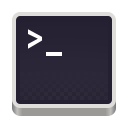

### Hi there, I'm Yong! Checkout my website here: 

## Currently a Master's student at UCSD, and aspiring to work in Computer Vision!
- :people_holding_hands: I am always looking for a collaboration with avid machine learning enthusiasts! Feel free to drop me an <a href="mailto:yyx.yongyuxuanB01@gmail.com">email<a> to work together!
- :pushpin: 2022 goals: Complete more pet projects, as well as ,master and get better at SQL!
- :mag" Check out my portfolio [here](yongyx.github.io)!

### :calling: Connect with Me!

### :toolbox: Languages & Tools

  
:zap: GitHub Stats

  

